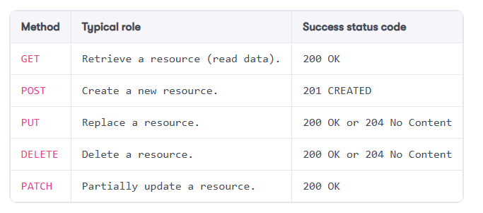

# Clean Architecture

## Separation of Concerns (SoC)

The idea is to separate the project or solution into logical blocks representing specific concern or aspect of the software.

**Benefits**
1. Maintainability
2. Modularity
3. Understandability

**Examples**

* Security and logging are cross-cutting concerns.
* Rendering a user interface is a concern.
* Handling an HTTP request is a concern.
* Copying an object into another is a concern.
* Orchestrating a distributed workflow is a concern.

## Don't repeat yourself (DRY)

The idea is that each block of code or concern should have a single, unambiguous representation within the project or system.

**Benefits**

1. Eliminate redundancy

```
public class Admin
{
    public async Task DisplayListAsync(
        IBookService bookService,
        IBookPresenter presenter)
    {
        var books = await bookService.FindAllAsync();
        foreach (var book in books)
        {
            await presenter.DisplayAsync(book);
        }
    }
}
public class Public
{
    public async Task DisplayAsync(
        IBookService bookService,
        IBookPresenter presenter)
    {
        var books = await bookService.FindAllAsync();
        foreach (var book in books)
        {
            await presenter.DisplayAsync(book);
        }
    }
}

```

The above two classes provides same function exept different class and method name. When you see duplication of code, encapsulate and refactor to reuse the logic.

```
public class Public
{
    public async Task DisplayAsync(
        IBookService bookService,
        IBookPresenter presenter)
    {
        var books = await bookService.FindAllAsync();
        foreach (var book in books)
        {
            await presenter.DisplayAsync(book);
        }
    }
}

public class AdminApp : Public
{
    // Additional admin functionalities
}
```

Additionally, we can encapsulate the IBookPresenter with books list instead passing the book so that we can pass different presenter implentation for different role.

## Keep it simple, stupid (KISS)

The idea is simplicity because more moving pieces mean breaks something. 

**Example**
1. Complex object hierarchy

## You Aren’t Gonna Need It (YAGNI)

The idea is add functionality when it is needed.

**Benefits**
1. Delivering incremental value
2. Flexibility

## SOLID Design Principles

SOLID principle extends basic OOP concept:
1. Abstraction
2. Encapsulation
3. Inheritance
4. Polymorphism

SOLID refers to below design principles:
* Single responsibility principle
* Open/closed principle
* Liskov substitution principle
* Interface segregation principle
* Dependency inversion principle

Why we need single responsibility principle?

* To maintain the code for ease of use
* To test every corner of the code
* To be flexible and extendable
* To allow simultaneous development
* And more

### Single Reponsibility Principle (SRP)

Each class and module should focus on a single task at a time and all members are related to single purpose.

```
public interface IUser 
{
    bool Login(string username, string password);
    bool Register(string username, string password);
    void Logout();
    void LogError(string error);  // Irrelevant to IUser
    void SendEmail(string email); // Irrelevant to IUser
}
```

In the above interface, LogError and SendEmail method are irrelevant to IUser interface. We need to create new interface for Logging and Emailing separately.

```
public interface IUser 
{
    bool Login(string username, string password);
    bool Register(string username, string password);
    void Logout();
}

public interface ILogger
{
    void LogError(string error);
}

public interface IEmail
{
    void SendEail(string email);
}
```

### Interface Segregation Principle (ISP)

No client should be forced to depend on methods it does not use.

```
public IPrinter
{
    void Print(string content);
    void Scan();
    void Email();
}

public class LaserPrinter : IPrinter
{
    void Print(string content)
    {
        // Print logic.
    }

    void Scan(){
        throw new NotImplementedException();
    }
    void Email(){
        throw new NotImplementedException();
    }
}

public class SmartPrinter : IPrinter
{
    void Print(string content)
    {
        // Print logic.
    }

    void Scan(){
        // scans the document
    }
    void Email(){
        // Scan and email printer
    }
}

```

The problem with the above IPrinter interface is that not all printer has scan and email functionality. Therefore, the Laser printer class is forced to implement the method. It throws NotImplementedException. Instead we should segregate the interfaces.

```
public interface IPrinter
{
    void Print(string content);
}
public interface IScanner
{
    void Scan();
}
public interface ISmartPrinter
{
    void Email();
}

public class LaserPrinter : IPrinter
{
    void Print(string content)
    {
        // Print logic.
    }
}

public class SmartPrinter : IPrinter, IScanner, ISmartPrinter
{
    void Print(string content)
    {
        // Print logic.
    }

    void Scan(){
        // scans the document
    }
    void Email(){
        // Scan and email printer
    }
}
```

In the above example, we segregated IPrinter interface into IScanner and ISmartPrinter. This reduced forced of certain Scan and Email method in LasetPrinter class.

 
### Open/Closed Principle (OCP)

”Software entities (classes, modules, functions, and so on) should be open for extension but closed for modification.”

**Composition over inheritance**

Composition over inheritance is a principle that suggests it’s better to build objects by combining simple, flexible parts (composition) rather than by inheriting properties from a larger, more complex object (inheritance).

```
public record class Entity();
public class EntityRepository
{
    public virtual Task CreateAsync(Entity entity)
        => throw new NotImplementedException();
}

namespace OCP.NoComposability;
public class EntityService : EntityRepository
{
    public async Task ComplexBusinessProcessAsync(Entity entity)
    {
        // Do some complex things here
        await CreateAsync(entity);
        // Do more complex things here
    }
}

```

The above example has inherited the interface EntityRepository. This creates complexity because if add more method to entity repository, it needs to handled in all inherited services. In some cases, we need to ensure it is not misused and breaks something. The alternative approach is to composition of EntityRepository to EntityService.

```
namespace OCP.Composability;
public class EntityService
{
    private readonly EntityRepository _repository
        = new EntityRepository(); // Can use dependency injection too
    public async Task ComplexBusinessProcessAsync(Entity entity)
    {
        // Do some complex things here
        await _repository.CreateAsync(entity);
        // Do more complex things here
    }
}
```

### Liskov substitution principle (LSP)

The LSP states that in a program, if we replace an instance of a superclass (supertype) with an instance of a subclass (subtype), the program should not break or behave unexpectedly.


### Dependency Inversion Principle (DIP)

”depend upon abstractions, not concretions.”



SomeService class depends only on an IDataPersistance interface (abstraction) that the SqlDataPersistence and LocalDataPersistence classes implement. We could then implement the CosmosDbDataPersistence class (not in the diagram) without impacting the SomeService class.


## Key takeaways

* Don’t over-engineer your solutions (KISS). 
* Encapsulate and reuse business logic (DRY). 
* Organize elements around concerns and responsibilities (SoC/SRP).
* Aim at composability (OCP).
* Support backward compatibility (LSP).
* Write granular interfaces/contracts (ISP).
* Depend on abstractions and invert the dependency flow (DIP).