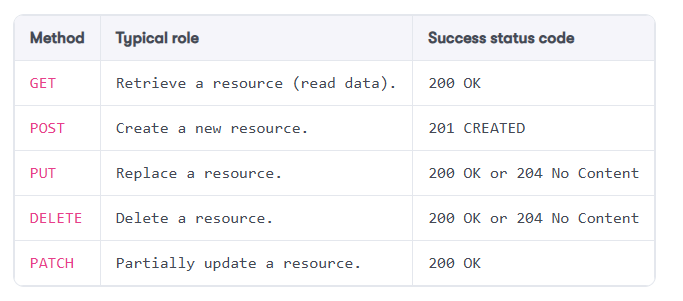

# REST, or REpresentational State Transfer APIs

**Key characteristics**

1. **Statelessness:** Server retains no information about previous HTTP request.
2. **Caching capabilities:** Clients should be able to cache responses to enhance performance.
3. **Simplicity and loose coupling**
4. **Resource identifiability:** Each API endpoint is a distinct resource and it enables us to secure them separately
5. **Interface as a contract:** The REST API layer serves as an exchange contract or an abstraction. 

**HTTP methods**

**HTTP status codes and headers:** HTTP status codes inform clients about the success or failure of their requests. HTTP headers transmit additional information and describe clients’ options and capabilities. Both are essential components of HTTP communication.
**Versioning:** Managing changes in APIs without disrupting existing clients is a significant challenge. Different strategies for API versioning can help address this issue, but each comes with its own trade-offs.
**Data Transfer Object (DTO):** DTOs package data into a format that can provide many benefits, including reducing the number of HTTP calls, improving encapsulation, and enhancing performance when sending data over the network.
**API contracts:** Clear and robust API contracts ensure API stability. They serve as a blueprint for interaction between an API and its consumers, outlining available endpoints, supported HTTP methods, expected request formats, and potential response structures.
**Practical application:** Understanding these concepts is not only theoretically important but also practically helpful in building and working with REST APIs using ASP.NET Core or any other similar technology.